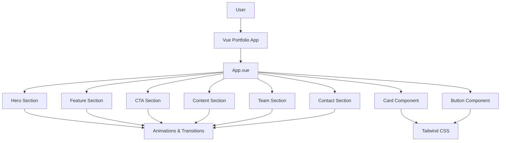

# Technical Design: Vue Portfolio with Animation

## Overview
This feature delivers a modern, responsive portfolio website with engaging animations to showcase personal projects and skills. The portfolio targets potential employers, collaborators, and clients who will utilize this for evaluating technical expertise and design capabilities. The implementation changes the current static portfolio approach by introducing Vue 3 composition API with TypeScript, component-based architecture with Tailwind CSS styling, and shadcn-inspired UI components enhanced with eye-catching animations.

### Goals
- Implement a responsive, visually appealing portfolio using Vue 3 and TypeScript
- Create reusable UI components following shadcn-inspired design patterns
- Integrate smooth animations and transitions for enhanced user experience
- Ensure accessibility compliance and optimal performance

### Non-Goals
- Backend authentication or user management system
- Content management system for dynamic content updates
- E-commerce functionality or payment processing
- Real-time collaboration features

## Architecture

### Existing Architecture Analysis
The current project uses Vue 3 with Composition API, TypeScript, Tailwind CSS, and Vite as the build tool. It follows a component-based architecture with a UI library pattern similar to shadcn. The design will leverage this existing structure and extend it to include animated portfolio sections.

### High-Level Architecture



**Architecture Integration**:
- Existing patterns preserved: Component-based architecture with Composition API
- New components rationale: Portfolio-specific sections with animation capabilities
- Technology alignment: Consistent with Vue 3, TypeScript, and Tailwind CSS stack
- Steering compliance: Follows established structure and tech guidelines

### Technology Stack and Design Decisions

**Technology Alignment**:
- Frontend Framework: Vue 3 with Composition API (existing)
- Language: TypeScript (existing)
- Styling: Tailwind CSS with Tailwind Merge for conditional classes (existing)
- Build Tool: Vite (existing)
- UI Components: Reka UI with custom shadcn-inspired components (existing)
- Icons: Lucide Vue Next (existing)
- Animations: Animate.css with Vue's built-in transition system

**Key Design Decisions**:

**Decision**: Use Vue's built-in transition system combined with Animate.css for animations
- **Context**: Need for smooth, performant animations that don't impact performance significantly
- **Alternatives**: Custom CSS animations, Framer Motion, GSAP, Vue's transition system alone
- **Selected Approach**: Vue's transition system with Animate.css classes for preset animations
- **Rationale**: Leverages Vue's reactivity for animation triggers while using Animate.css for pre-built, performant animations
- **Trade-offs**: Slight increase in bundle size from Animate.css but significant time savings and variety of animations

**Decision**: Implement component library pattern for UI elements
- **Context**: Need for consistent, reusable UI components that align with shadcn patterns
- **Alternatives**: Using external component libraries (Element Plus, Vuetify), building components individually
- **Selected Approach**: Maintain existing UI component pattern with separate component files and index exports
- **Rationale**: Provides full control over styling and functionality while maintaining consistency
- **Trade-offs**: More initial development time but better long-term maintainability and customization

## Components and Interfaces

### Portfolio Sections

#### HeroSection Component
**Responsibility & Boundaries**
- **Primary Responsibility**: Display the main headline and introductory content of the portfolio
- **Domain Boundary**: Presentation layer
- **Data Ownership**: Owns its visual presentation data
- **Transaction Boundary**: Not applicable

**Dependencies**
- **Inbound**: App.vue
- **Outbound**: Button component for call-to-action
- **External**: Animate.css for entrance animations

**Contract Definition**
```typescript
interface HeroSectionProps {
  title: string;
  subtitle: string;
  description: string;
  ctaText: string;
  ctaLink: string;
}

interface HeroSectionEmits {
  ctaClick: () => void;
}
```

#### FeatureSection Component
**Responsibility & Boundaries**
- **Primary Responsibility**: Display key features or skills in an organized format
- **Domain Boundary**: Presentation layer
- **Data Ownership**: Owns feature content data
- **Transaction Boundary**: Not applicable

**Dependencies**
- **Inbound**: App.vue
- **Outbound**: Card component for feature display
- **External**: Animate.css for entrance animations

**Contract Definition**
```typescript
interface FeatureItem {
  icon: string; // Lucide icon name
  title: string;
  description: string;
}

interface FeatureSectionProps {
  features: FeatureItem[];
}
```

#### ProjectCard Component
**Responsibility & Boundaries**
- **Primary Responsibility**: Display project information including thumbnail, title, description, and links
- **Domain Boundary**: Presentation layer
- **Data Ownership**: Owns project display data
- **Transaction Boundary**: Not applicable

**Dependencies**
- **Inbound**: ContentSection.vue
- **Outbound**: Button component for project links
- **External**: Tailwind CSS for styling

**Contract Definition**
```typescript
interface Project {
  id: string;
  title: string;
  description: string;
  thumbnail: string;
  liveUrl?: string;
  sourceUrl?: string;
  tags: string[];
}

interface ProjectCardProps {
  project: Project;
}

interface ProjectCardEmits {
  liveClick: (projectId: string) => void;
  sourceClick: (projectId: string) => void;
}
```

### UI Components

#### Button Component
**Responsibility & Boundaries**
- **Primary Responsibility**: Provide consistent, accessible button functionality across the portfolio
- **Domain Boundary**: UI component layer
- **Data Ownership**: Owns its styling variants and accessibility attributes
- **Transaction Boundary**: Not applicable

**Contract Definition**
```typescript
type ButtonVariant = 'default' | 'destructive' | 'outline' | 'secondary' | 'ghost' | 'link';
type ButtonSize = 'default' | 'xs' | 'sm' | 'lg' | 'icon' | 'icon-sm' | 'icon-lg';

interface ButtonProps {
  variant?: ButtonVariant;
  size?: ButtonSize;
  asChild?: boolean;
  disabled?: boolean;
}

interface ButtonEmits {
  click: (event: MouseEvent) => void;
}
```

#### Card Component
**Responsibility & Boundaries**
- **Primary Responsibility**: Provide a consistent container component for grouping related content
- **Domain Boundary**: UI component layer
- **Data Ownership**: Owns its structural composition (header, content, footer)
- **Transaction Boundary**: Not applicable

**Contract Definition**
```typescript
interface CardProps {
  class?: string;
}

interface CardHeaderProps {
  class?: string;
}

interface CardTitleProps {
  class?: string;
}

interface CardContentProps {
  class?: string;
}

interface CardFooterProps {
  class?: string;
}
```

## Data Models

### Domain Model

**Core Concepts**:
- **Project**: Represents a portfolio project with metadata and links
- **Feature/Skill**: Represents a technical skill or feature capability
- **ContactInfo**: Represents contact information for portfolio owner
- **SocialLink**: Represents social media or professional profile links

```typescript
interface Project {
  id: string;
  title: string;
  description: string;
  thumbnail: string;
  liveUrl?: string;
  sourceUrl?: string;
  tags: string[];
  order: number;
}

interface Feature {
  id: string;
  icon: string; // Lucide icon name
  title: string;
  description: string;
  order: number;
}

interface ContactInfo {
  email: string;
  phone?: string;
  location?: string;
  socialLinks: SocialLink[];
}

interface SocialLink {
  name: string;
  url: string;
  icon: string; // Lucide icon name
}
```

## Error Handling

### Error Strategy
For a static portfolio site, errors are primarily related to content loading and user interactions. The portfolio will use graceful degradation for any content loading issues.

### Error Categories and Responses
**Content Loading**: If project images fail to load → fallback image with error handling
**External Link Issues**: If project links are invalid → standard error handling in browser

## Testing Strategy

### Unit Tests
- ProjectCard component rendering with different project data
- Button component with different variants and states
- Animation triggers and transitions
- Responsive layout switching logic
- Form validation (if contact form is implemented)

### Integration Tests
- HeroSection with navigation integration
- ProjectSection fetching and displaying project data
- Contact form submission (if implemented)
- UI component library integration

### E2E/UI Tests
- Navigation between portfolio sections
- Responsive layout behavior across device sizes
- Animation triggers on scroll and interaction
- Project card link functionality

## Security Considerations
- Input sanitization for any contact form fields
- Secure handling of external links
- Content security policy implementation

## Performance & Scalability
- Optimize images with appropriate formats and sizes
- Implement lazy loading for images outside the viewport
- Minimize bundle size by treeshaking unused animations
- Use efficient CSS animations (transform, opacity) rather than layout properties